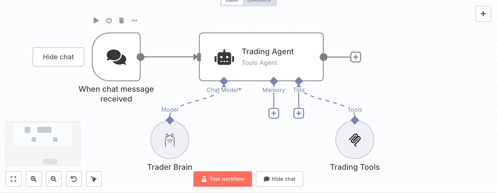

# AI trading agent

AI agent which is able to analyze and make trading actions like:

- Ask for candles
- Place an order

As for now this repo is underconstruction.
Basically I will develop all the functionalities and then I will use fastmcp to create an
MCP server the LLM can use.

The project is meant to work locally, so has been thought for SLM (Small Language Model), it's done also for learning purpose.

## n8n

To make this project work properly you need to use n8n which is free on local machine, so before to start you need to setup n8n and the agent using n8n.
All you need is somthing like this:

### Personal consideration
I used n8n because for now allows me to see better the flow and gives me a kind of easy to test workflow, if the project goes on
and I could have the needs to scale then I will think how to do it, but for now n8n is the way.

In this moment I'm only bulding the pieces.

Enjoy :D.